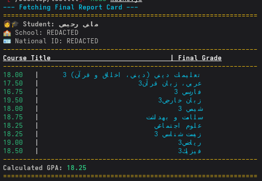

# 🚀 کلاینت Node.js برای API سامانه دانا (danameduapi)

این پروژه یک کلاینت غیررسمی برای API وب‌سایت `dana.medu.ir` است که از طریق مهندسی معکوس کلاینت وب توسعه داده شده است. هدف اصلی این پروژه، فراهم کردن یک رابط برنامه‌نویسی (API Wrapper) تمیز و قابل استفاده در محیط Node.js برای دسترسی به اطلاعات دانش‌آموزی، مانند کارنامه (کارنامه نهایی)، است.

## ✨ ویژگی‌ها

- **احراز هویت امن:** با استفاده از کوکی (`cookie`) و `client-id` استخراج شده از نشست (session) کاربر، به صورت امن به API متصل می‌شود.
- **رمزگشایی خودکار:** پاسخ‌های رمزنگاری شده سرور را با پیاده‌سازی الگوریتم `AES` و کلید مشتق‌شده از `client-id` (همانند کلاینت اصلی) به صورت خودکار رمزگشایی می‌کند.
- **رابط کاربری ساده:** ارائه متدهای ساده و قابل فهم برای دریافت اطلاعات پیچیده، مانند `getReportCard()`.
- **کلاس‌های کمکی:** شامل کلاس `ReportCard` برای دسترسی آسان و پردازش اطلاعات کارنامه (مانند محاسبه معدل).
- **بدون وابستگی‌های اضافی:** فقط به `axios` و `crypto-js` نیاز دارد.

## 🖼️ خروجی نمونه

خروجی اسکریپت `example.js` که کارنامه را با استایل‌دهی در ترمینال نمایش می‌دهد:



## 🔧 نصب و راه‌اندازی

ابتدا، پکیج‌های مورد نیاز را نصب کنید:
```bash
npm install axios crypto-js chalk@4.1.2
```

## ⚙️ نحوه استفاده

برای استفاده از این کتابخانه، ابتدا باید اطلاعات احراز هویت خود را از وب‌سایت `dana.medu.ir` استخراج کنید.

**چگونه اطلاعات خود را پیدا کنیم؟**
1.  وارد حساب کاربری خود در `dana.medu.ir` شوید.
2.  ابزار توسعه‌دهندگان مرورگر خود را باز کنید (معمولاً با کلید F12).
3.  به تب `Network` (شبکه) بروید.
4.  صفحه را رفرش کنید و یکی از درخواست‌های `get-data-source` را پیدا کنید.
5.  در بخش `Headers` درخواست، مقادیر `cookie` و `client-id` را کپی کنید.

سپس، می‌توانید از کتابخانه مانند مثال زیر استفاده کنید:

```javascript
const { DanaClient } = require('./dana-api.js');

// اطلاعات احراز هویت خود را اینجا قرار دهید
// توصیه می‌شود از متغیرهای محیطی استفاده کنید
const credentials = {
    cookie: 'sid=s%3A...', // کوکی کپی شده
    clientId: 'lwc77byu-...',   // کلاینت آیدی کپی شده
};

const dana = new DanaClient(credentials);

async function fetchReportCard() {
    try {
        // شناسه‌ی دوره امتحان نهایی (برای مثال خرداد ۱۴۰۳)
        const implPath = 'EXMlosj07z63gdPL6IM3';
        const reportCard = await dana.getReportCard(implPath);

        console.log(`دانش آموز: ${reportCard.getStudentFullName()}`);
        console.log(`مدرسه: ${reportCard.getSchoolName()}`);
        console.log("--- نمرات ---");
        
        reportCard.getGrades().forEach(course => {
            console.log(`${course.title}: ${course.finalGrade || 'N/A'}`);
        });

        console.log(`\nمعدل کل: ${reportCard.calculateGPA()}`);

    } catch (error) {
        console.error(`خطا: ${error.message}`);
    }
}

fetchReportCard();
```
*فایل `example.js` در این ریپازیتوری، یک مثال کامل‌تر با خروجی رنگی و زیبا ارائه می‌دهد.*

## ⚠️ سلب مسئولیت (Disclaimer)

این پروژه یک ابزار **غیررسمی** است و به هیچ‌وجه به وزارت آموزش و پرورش وابستگی ندارد. این ابزار تنها برای اهداف آموزشی و نمایش توانایی‌های فنی در زمینه مهندسی معکوس و توسعه نرم‌افزار ایجاد شده است. مسئولیت استفاده از این کد کاملاً بر عهده کاربر است.

## 📄 لایسنس

این پروژه تحت لایسنس MIT منتشر شده است.
